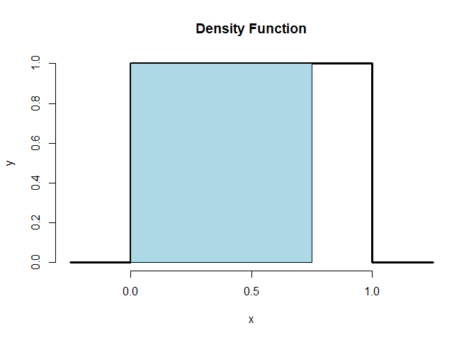

`Quiz 1` Statistical Inference
================

-   👨🏻‍💻 Author: Anderson H Uyekita
-   📚 Specialization: <a
    href="https://www.coursera.org/specializations/data-science-statistics-machine-learning"
    target="_blank" rel="noopener">Data Science: Statistics and Machine
    Learning Specialization</a>
-   📖 Course:
    <a href="https://www.coursera.org/learn/statistical-inference"
    target="_blank" rel="noopener">Statistical Inference</a>
    -   🧑‍🏫 Instructor: Brian Caffo
-   📆 Week 1
    -   🚦 Start: Wednesday, 29 June 2022
    -   🏁 Finish: Thursday, 30 June 2022
-   🌎 Rpubs: [Interactive
    Document](https://rpubs.com/AndersonUyekita/quiz-1_statistical-inference)

------------------------------------------------------------------------

## Question 1

Consider influenza epidemics for two parent heterosexual families.
Suppose that the probability is 17% that at least one of the parents has
contracted the disease. The probability that the father has contracted
influenza is 12% while the probability that both the mother and father
have contracted the disease is 6%. What is the probability that the
mother has contracted influenza?

*(Hints look at lecture 2 around 5:30 and chapter 4 problem 4).*

-   [x] 11%
-   [ ] 17%
-   [ ] 6%
-   [ ] 5%

**Answer**

The events can simultaneously occur and so are **not mutually
exclusive**.

Consider:

-   "):
    Only father probability to be infected;
-   "):
    Only mother probability to be infected;
-   "):
    (intersection) father and mother probability infected, and;
-   "):
    (union) All cases of infection.

According to the formula:

}_{17\%} = \underbrace{P(A)}_{12\%} + P(B) - \underbrace{P(A \cap B)}_{6\%}")

Thus:

 = 17\% - 12\% + 6\% = 11\%")

## Question 2

A random variable,

is uniform, a box from 0 to 1 of height 1. (So that its density is
 = 1")
for
.)
What is its 75th percentile? (Hints, look at lecture 2 around 21:30 and
Chapter 5 Problem 5. Also, look up the help function for the qunif
command in R.)

*(Hints, look at lecture 2 around 21:30 and Chapter 5 Problem 5. Also,
look up the help function for the qunif command in R.)*

-   [ ] 0.25
-   [ ] 0.50
-   [ ] 0.10
-   [x] 0.75

**Answer**

<!-- -->

The 75th percentile represents the blue area.

``` r
# Calculating using R.
stats::qunif(p = 0.75, min = 0, max = 1)
```

    ## [1] 0.75

## Question 3

You are playing a game with a friend where you flip a coin and if it
comes up heads you give her

dollars and if it comes up tails she gives you

dollars. The probability that the coin is heads is p (some number
between

and
).
What has to be true about

and

to make so that both of your expected total earnings is
.
The game would then be called “fair”.

*(Hints, look at Lecture 4 from 0 to 6:50 and Chapter 5 Problem 6. Also,
for further reading on fair games and gambling, start with the Dutch
Book problem).*

-   [ ]
    
-   [x]
    
-   [ ]
    
-   [ ]
    

**Answer**

}_{1-p} - \underbrace{Loss}_{X} \cdot \underbrace{P(Head)}_{p}")

}_{1-p} - \underbrace{Loss}_{X} \cdot \underbrace{P(Head)}_{p} = 0")


## Question 4

A density that looks like a normal density (but may or may not be
exactly normal) is exactly symmetric about zero. (Symmetric means if you
flip it around zero it looks the same.) What is its median?

*(Hints, look at quantiles from Lecture 2 around 21:30 and Chapter 2
Problem 7.*

-   [ ] The median must be different from the mean.
-   [x] The median must be 0.
-   [ ] We can’t conclude anything about the median.
-   [ ] The median must be 1.

**Answer**

``` r
# Symmetric mean 50% in both sides.
qnorm(p = 0.50, mean = 0)
```

    ## [1] 0

## Question 5

Consider the following PMF shown below in R

``` r
x <- 1:4
p <- x/sum(x)
temp <- rbind(x, p)
rownames(temp) <- c("X", "Prob")
temp
```

    ##      [,1] [,2] [,3] [,4]
    ## X     1.0  2.0  3.0  4.0
    ## Prob  0.1  0.2  0.3  0.4

What is the mean?

*(Hint, watch Lecture 4 on expectations of PMFs.)*

-   [ ] 4
-   [ ] 1
-   [x] 3
-   [ ] 2

**Answer**

``` r
sum(temp["X",] * temp["Prob",])/sum(temp["Prob",])
```

    ## [1] 3

## Question 6

A web site (www.medicine.ox.ac.uk/bandolier/band64/b64-7.html) for home
pregnancy tests cites the following: “When the subjects using the test
were women who collected and tested their own samples, the overall
sensitivity was 75%. Specificity was also low, in the range 52% to 75%.”
Assume the lower value for the specificity. Suppose a subject has a
positive test and that 30% of women taking pregnancy tests are actually
pregnant. What number is closest to the probability of pregnancy given
the positive test?

*(Hints, watch Lecture 3 at around 7 minutes for a similar example.
Also, there’s a lot of Bayes’ rule problems and descriptions out there,
for example here’s one for HIV testing. Note, discussions of Bayes’ rule
can get pretty heady. So if it’s new to you, stick to basic treatments
of the problem. Also see Chapter 3 Question 5.)*

-   [x] 40%
-   [ ] 30%
-   [ ] 20%
-   [ ] 10%

**Answer**

-   sensitivity
    (")):
    75%
-   specificity
    (")):
    52%
-   prevalence
    (")):
    30%

![ P(D\|+) = \\frac{\\overbrace{P(+\|D)}^{sensitivity} \\cdot \\overbrace{P(D)}^{prevalence}}{P(+\|D) \\cdot P(D)+\[1-\\underbrace{P(-\|D^C)}\_{specificity}\] \\cdot \[1-P(D)\]}](https://latex.codecogs.com/png.image?%5Cdpi%7B110%7D&space;%5Cbg_white&space;%20P%28D%7C%2B%29%20%3D%20%5Cfrac%7B%5Coverbrace%7BP%28%2B%7CD%29%7D%5E%7Bsensitivity%7D%20%5Ccdot%20%5Coverbrace%7BP%28D%29%7D%5E%7Bprevalence%7D%7D%7BP%28%2B%7CD%29%20%5Ccdot%20P%28D%29%2B%5B1-%5Cunderbrace%7BP%28-%7CD%5EC%29%7D_%7Bspecificity%7D%5D%20%5Ccdot%20%5B1-P%28D%29%5D%7D " P(D|+) = \frac{\overbrace{P(+|D)}^{sensitivity} \cdot \overbrace{P(D)}^{prevalence}}{P(+|D) \cdot P(D)+[1-\underbrace{P(-|D^C)}_{specificity}] \cdot [1-P(D)]}")

![ P(D\|+) = \\frac{\\overbrace{0.75}^{sensitivity} \\cdot \\overbrace{0.30}^{prevalence}}{0.75 \\cdot 0.30+\[1-\\underbrace{0.52}\_{specificity}\] \\cdot \[1-0.30\]} = 0.4011](https://latex.codecogs.com/png.image?%5Cdpi%7B110%7D&space;%5Cbg_white&space;%20P%28D%7C%2B%29%20%3D%20%5Cfrac%7B%5Coverbrace%7B0.75%7D%5E%7Bsensitivity%7D%20%5Ccdot%20%5Coverbrace%7B0.30%7D%5E%7Bprevalence%7D%7D%7B0.75%20%5Ccdot%200.30%2B%5B1-%5Cunderbrace%7B0.52%7D_%7Bspecificity%7D%5D%20%5Ccdot%20%5B1-0.30%5D%7D%20%3D%200.4011 " P(D|+) = \frac{\overbrace{0.75}^{sensitivity} \cdot \overbrace{0.30}^{prevalence}}{0.75 \cdot 0.30+[1-\underbrace{0.52}_{specificity}] \cdot [1-0.30]} = 0.4011")

``` r
#Calculating using R.
(0.75*0.30)/(0.75*0.30+0.48*0.70)
```

    ## [1] 0.4010695
