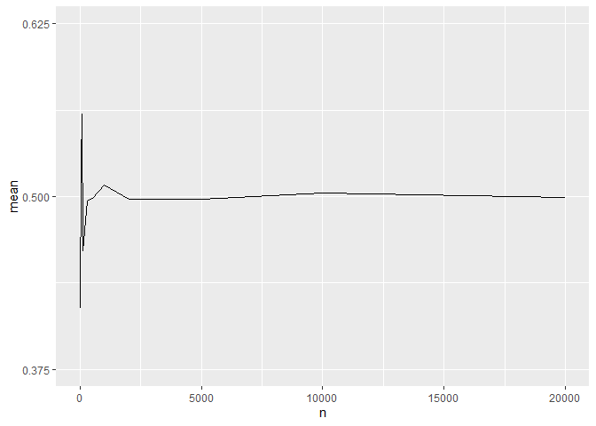

`Quiz 2` Statistical Inference
================

-   👨🏻‍💻 Author: Anderson H Uyekita
-   📚 Specialization: <a
    href="https://www.coursera.org/specializations/data-science-statistics-machine-learning"
    target="_blank" rel="noopener">Data Science: Statistics and Machine
    Learning Specialization</a>
-   📖 Course:
    <a href="https://www.coursera.org/learn/statistical-inference"
    target="_blank" rel="noopener">Statistical Inference</a>
    -   🧑‍🏫 Instructor: Brian Caffo
-   📆 Week 2
    -   🚦 Start: Thursday, 30 June 2022
    -   🏁 Finish: Thursday, 30 June 2022
-   🌎 Rpubs: [Interactive
    Document](https://rpubs.com/AndersonUyekita/quiz-2_statistical-inference)

------------------------------------------------------------------------

## Question 1

What is the variance of the distribution of the average an IID
(independent and identically distributed) draw of

observations from a population with mean

and variance
.

-   [ ]
    
-   [ ]
    
-   [x]
    
-   [ ]
    

**Answer**

 = \frac{\sigma^2}{n}")

Where:

-   :
    population variance
-   :
    number of observation
-   "):
    Variance of the sample mean

## Question 2

Suppose that diastolic blood pressures (DBPs) for men aged 35-44 are
normally distributed with a mean of 80 (mm Hg) and a standard deviation
of 10. About what is the probability that a random 35-44 year old has a
DBP less than 70?

-   [ ] 22%
-   [x] 16%
-   [ ] 8%
-   [ ] 32%

**Answer**

> normally distributed

``` r
# option 1
pnorm(q = 70, mean = 80, sd = 10, lower.tail = TRUE)
```

    ## [1] 0.1586553

``` r
# option 2
pnorm(q = (70-80)/10, lower.tail = TRUE)
```

    ## [1] 0.1586553

## Question 3

Brain volume for adult women is normally distributed with a mean of
about 1,100 cc for women with a standard deviation of 75 cc. What brain
volume represents the 95th percentile?

-   [ ] approximately 977
-   [ ] approximately 1175
-   [ ] approximately 1247
-   [x] approximately 1223

**Answer**

> normally distributed

``` r
qnorm(p = 0.95, mean = 1100, sd = 75)
```

    ## [1] 1223.364

## Question 4

Refer to the previous question. Brain volume for adult women is about
1,100 cc for women with a standard deviation of 75 cc. Consider the
sample mean of 100 random adult women from this population. What is the
95th percentile of the distribution of that sample mean?

-   [x] approximately 1112 cc
-   [ ] approximately 1115 cc
-   [ ] approximately 1110 cc
-   [ ] approximately 1088 cc

**Answer**

> normally distributed

``` r
qnorm(p = 0.95, mean = 1100, sd = 75/sqrt(100))
```

    ## [1] 1112.336

## Question 5

You flip a fair coin 5 times, about what’s the probability of getting 4
or 5 heads?

-   [ ] 12%
-   [x] 19%
-   [ ] 6%
-   [ ] 3%

**Answer**

> Binomial Distribution

4 out of 5 coin tosses should be heads:

^{5-4} \cdot (p)^4")

5 out of 5 coin tosses should be heads:

^{5-5} \cdot (p)^5")

Thus:


``` r
p <- 0.5
n <- 5

P1 <- (factorial(5) / (factorial(5-4) * factorial(4))) * (1 - p)^(n-4) * (p)^(4)
P2 <- (factorial(5) / (factorial(5-5) * factorial(5))) * (1 - p)^(n-5) * (p)^(5)

R <- P1 + P2

R
```

    ## [1] 0.1875

## Question 6

The respiratory disturbance index (RDI), a measure of sleep disturbance,
for a specific population has a mean of 15 (sleep events per hour) and a
standard deviation of 10. They are not normally distributed. Give your
best estimate of the probability that a sample mean RDI of 100 people is
between 14 and 16 events per hour?

-   [ ] 47.5%
-   [ ] 34%
-   [ ] 95%
-   [x] 68%

**Answer**

> **not** normally distributed

``` r
p1 <- pnorm((14-15)/(10/sqrt(100)), lower.tail = TRUE)

p2 <- pnorm((16-15)/(10/sqrt(100)), lower.tail = TRUE)

p2 - p1
```

    ## [1] 0.6826895

## Question 7

Consider a standard uniform density. The mean for this density is .5 and
the variance is
.
You sample 1,000 observations from this distribution and take the sample
mean, what value would you expect it to be near?

-   [ ] 0.25
-   [ ] 0.10
-   [ ] 0.75
-   [x] 0.5

**Answer**

> Law of large numbers in action (LLN)

 = \sigma^2 = \frac{1}{12} = \frac{(b-a)^2}{12}")


and


``` r
library(ggplot2)

set.seed(2022)

n <- c(10,50,75,100,300,500,1000,2000,5000,10000, 20000)
df <- data.frame("mean" = rep(NA, length(n)),"n" = rep(NA, length(n)), "var" = rep(NA, length(n)))

for (i in 1:length(n)) {
     df$mean[i] <- mean(runif(n = n[i], min = 0, max = 1))
     df$var[i] <- sd(runif(n = n[i], min = 0, max = 1))^2
     df$n[i] <- n[i]
}

ggplot(data = df, aes(x = n, y = mean)) +
    geom_line() +
    scale_y_continuous(limits = c(0.375, 0.625), breaks = seq(0.25, 0.75, by = 0.125))
```

<!-- -->

## Question 8

The number of people showing up at a bus stop is assumed to be Poisson
with a mean of 5 people per hour. You watch the bus stop for 3 hours.
About what’s the probability of viewing 10 or fewer people?

-   [x] 0.12
-   [ ] 0.03
-   [ ] 0.08
-   [ ] 0.06

**Answer**

> Poisson Distribution

``` r
ppois(q = 10,lambda = 5 * 3)
```

    ## [1] 0.1184644
